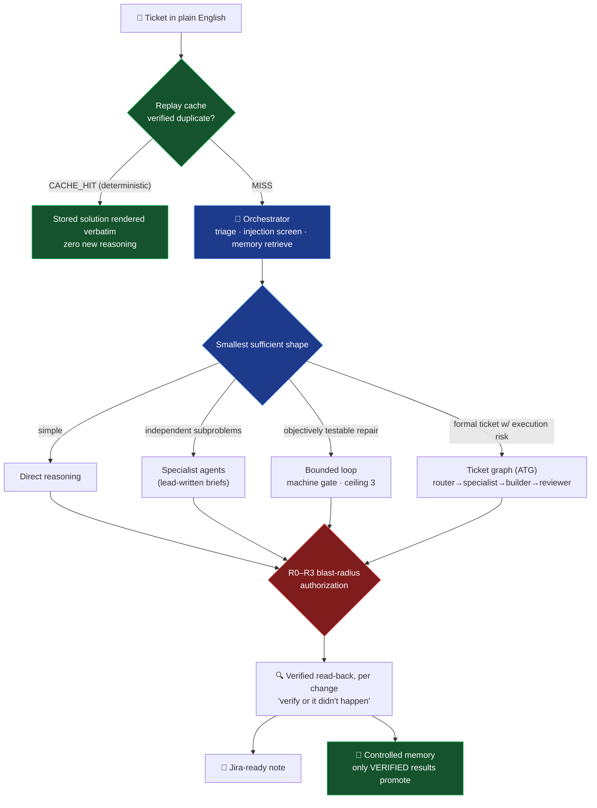

<div align="center">

# 🛡️ Aegis

### An adaptive AI harness for real IT operations, built on Claude Code

**Give it an IT problem in plain English. It picks the smallest sufficient execution shape — deterministic replay, direct reasoning, specialist agents, bounded loops, or an execution graph — solves it under risk-classified authorization, verifies the result, and retains only verified operational memory.**

<br>

[](https://github.com/qFermions/Aegis/actions/workflows/release-gate.yml)
[](#-the-safety-model)
[](#-the-safety-model)
[](#-whats-inside)
[](#-run-the-evidence)
[](LICENSE)

[🧭 How it works](#-how-it-works) · [🚀 Try it](#-try-it--5-minutes) · [🔐 Safety model](#-the-safety-model) · [🧪 Evidence](#-run-the-evidence) · [📦 What's inside](#-whats-inside) · [🧩 Adapt it](#-adapting-it-to-your-environment)

</div>

---

## The problem

An IT administrator's day is tickets: *"[FIRST_NAME] keeps getting asked for her Outlook password after I reset it."* Solving them with an LLM usually means one of two bad deals — a chat assistant with no memory, no gates, and no way to prove anything happened; or an agent framework the admin has to program and babysit. Aegis is the third option: **the operator types the problem; the harness owns everything underneath it.**

## 🧭 How it works

You type the ticket in ordinary English. The orchestrator inside Aegis routes it through the cheapest shape that can solve it correctly:


```mermaid
flowchart TD
    T["🎫 Ticket in plain English"] --> RP{"Replay cache<br>verified duplicate?"}
    RP -- "CACHE_HIT (deterministic)" --> REN["Stored solution rendered verbatim<br>zero new reasoning"]
    RP -- MISS --> B["🧠 Orchestrator<br>triage · injection screen · memory retrieve"]
    B --> S{"Smallest sufficient shape"}
    S -- "simple" --> D["Direct reasoning"]
    S -- "independent subproblems" --> A["Specialist agents<br>(lead-written briefs)"]
    S -- "objectively testable repair" --> L["Bounded loop<br>machine gate · ceiling 3"]
    S -- "formal ticket w/ execution risk" --> G["Ticket graph (ATG)<br>router→specialist→builder→reviewer"]
    D --> R{"R0–R3 blast-radius<br>authorization"}
    A --> R
    L --> R
    G --> R
    R --> V["🔍 Verified read-back, per change<br>'verify or it didn't happen'"]
    V --> J["📝 Jira-ready note"]
    V --> M["🧠 Controlled memory<br>only VERIFIED results promote"]

    classDef fast fill:#14532d,stroke:#22c55e,color:#ffffff
    classDef gate fill:#7f1d1d,stroke:#ef4444,color:#ffffff
    classDef brain fill:#1e3a8a,stroke:#60a5fa,color:#ffffff
    class RP,REN,M fast
    class R gate
    class B,S brain
```

- **Deterministic replay** (`scripts/replay/`) — a previously *verified* solution with an unchanged authority basis replays instantly: normalization + sha256 keying decide "exact duplicate," never an LLM. Invalidation is dependency-fingerprint based, not a time TTL. Stale answers are preserved as history, never served as current.
- **Controlled memory** (`scripts/memory/`) — propose → gated promote → bounded retrieval. Unverified output cannot become trusted memory; every entry carries provenance fingerprints.
- **Ticket graph** (`scripts/graph/`) — a deterministic state machine (router → specialist → builder → reviewer → risk finalizer → verifier → scribe) with hash-bound human gates, a 3-round review ceiling, and typed artifacts. The reviewer can fail a plan; nothing agent-derived can satisfy a human gate.
- **Bounded loops** — only against machine-checkable gates (test suite, scanner, validator exit code), with a declared attempt ceiling.
- **Independent review** — multi-system or irreversible plans require a maker ≠ checker review in a fresh context before execution; the graph records `independentReviewRequired` and nothing in-session can satisfy it.
- **Every answer lands twice** — exact admin-portal click path first, line-by-line-commented PowerShell second, then a verification checklist and a paste-ready Jira note.

## 🚀 Try it — 5 minutes

**Prerequisites:** [Claude Code](https://claude.ai/code) with your own Anthropic account · Git · Node.js.

```bash
# PREVIEW ONLY [readme-repo-clone]: git clone https://github.com/qFermions/Aegis
cd Aegis
claude
```

1. Paste a ticket in plain words: *"User can't sign in, says account is locked"* — watch it produce Verdict → checks → fix → verification → Jira-ready note.
2. **`/new-user`** — the full onboarding runbook. It never asks you for a real name; placeholders are enforced.
3. The replay fast path, with no model at all (sandbox the store with `AEGIS_REPLAY_DIR=/tmp/replay-demo` to keep your real cache clean and make the demo rerunnable):
   ```bash
   node scripts/replay/replay-cli.js record --ticket "Onboard a new hire: [FIRST_NAME] [LAST_NAME], starts [START_DATE], standard staff profile at [@Aegion]." --solution-file scripts/replay/fixtures/onboard-demo.md --deps modules/security/security-doctrine.md
   node scripts/replay/replay-cli.js verify case-0001 --evidence "demo fixture — synthetic verification"
   node scripts/replay/replay-cli.js lookup --ticket "ONBOARD a new hire [FIRST_NAME] [LAST_NAME] starts [START_DATE] standard staff profile at [@Aegion]"   # → CACHE_HIT
   ```

## 🔐 The safety model

An LLM with admin-portal knowledge is a loaded tool. Safety is layered and testable:

1. **R0–R3 blast-radius authorization** — R0–R3 is behavioral policy supplied to the model; deterministic controls (CLI gates, scanners, tests) enforce what they can check ([ADR-001](docs/adr/ADR-001-blast-radius-classes.md)) — reads are free; every write climbs a ceremony ladder. R1 states its undo inline, R2 captures pre-state *first* (Entra/Intune don't keep your before-state), R3 requires an explicit human gate that urgency claims can never bypass, plus independent review for multi-system plans.
2. **Placeholders, always** — no real names, UPNs, tenant identifiers anywhere; the canonical token dictionary is [`modules/security/placeholder-dictionary.md`](modules/security/placeholder-dictionary.md), and the immutable rules (SR-1…SR-8) live in [`modules/security/security-doctrine.md`](modules/security/security-doctrine.md).
3. **Content ≠ instructions** — pasted emails, tickets, and logs are data; injection attempts are flagged, not followed.
4. **Deterministic gates outside the model** — `scripts/pre-commit-check.js` blocks PII/credentials/secret formats at commit and in CI (keyless, pattern-only by design); `scripts/harness/release-boundary-check.js` makes it structurally hard for private or unrelated material to ride into a release.

> [!TIP]
> **Don't take this section's word for it.** [EVALUATE.md](EVALUATE.md) is a 10-minute guided red-team with a pass/fail scorecard, and the full T1–T10 adversarial probe suite (expected behavior specified per probe) is in [`modules/security/threat_model.md`](modules/security/threat_model.md). Run them against the agent and score it yourself.

## 🧪 Run the evidence

Every load-bearing claim above has a runnable check:

```bash
node scripts/graph/graph.test.js        # 33 — graph engine: gates, hash-bound approval, review ceiling
node scripts/memory/memory.test.js      # 14 — controlled memory: gated promotion, provenance, staleness
node scripts/replay/replay.test.js      #  8 — replay: verified-only, fingerprint invalidation, zero-model path
node scripts/jira-client.test.js        # 14 — Jira client: dry-run-first, zero-network tripwire
node scripts/pre-commit-check.js --all  # full-tree PII/credential/secret scan (the CI release gate)
node scripts/harness/release-boundary-check.js  # public/private boundary holds
```

## 📦 What's inside

```
CLAUDE.md                    # The harness contract — mission, environment, rules, orchestration
modules/security/            # Native governance: security-doctrine (SR-1…SR-8), placeholder
                             # dictionary, threat model (T1–T10), IR playbooks + scripts
.claude/commands/            # 58 runbook slash commands — onboarding/offboarding, MFA, Intune,
                             # Meraki, VoIP, Exchange, Jira, troubleshooting trees
scripts/
├── replay/                  # Deterministic replay cache engine + suite + synthetic fixtures
├── memory/                  # Controlled operational memory engine + suite
├── graph/                   # Ticket-graph execution engine + adversarial suite
├── harness/                 # Continuity checker + release-boundary guard
├── jira-client.js           # JSM REST client — dry-run-first, env-var auth (+ 14-case suite)
└── pre-commit-check.js      # The commit/CI safety scanner
docs/                        # Architecture, ADRs, security model, worked ticket examples
modules/{it_support,systems,automation}/   # Procedure depth: diagnostics, AD Connect, PS safety
```

### The ideas that make it work

- **The harness is files.** Identity, rules, gates, and orchestration doctrine are version-controlled Markdown + zero-dependency Node. No infrastructure, no fine-tuning, no framework.
- **Cost follows complexity.** A verified duplicate costs zero reasoning; a simple ticket stays direct; agents/loops/graphs fire only when the problem genuinely needs them.
- **Only verified results become memory.** Drafts, guesses, and failed attempts cannot enter the replay cache or the trusted memory store — enforced by tests, not intentions.
- **Built from real support workflows** at a multi-site nonprofit (hybrid AD · M365 · Entra · Intune · Exchange Online · Meraki · VoIP), then placeholder-sanitized. Worked ticket arcs: [docs/ticket-examples.md](docs/ticket-examples.md).

## 🔓 Public/private boundary

This public repo contains the **real product**: the same harness contract, engines, gates, and test suites the private deployment runs. What stays private is *data*, not behavior: real tickets, tenant values (env-var only), the operator's replay/memory stores (git-ignored), and org-specific operational state. The boundary is enforced mechanically — release-gate CI, the boundary guard, and replay suite test R8.

## 🧩 Adapting it to your environment

1. Keep committed files placeholder-only — don't replace `[@Aegion_*]` tokens with real values in tracked files.
2. Real values live in env vars (see `.env.example`) or git-ignored local files.
3. Install the pre-commit scanner before you start editing:

```bash
# PREVIEW ONLY [readme-hook-install]: install a reviewed hook without overwriting an existing hook
# printf '%s
' '#!/bin/sh' 'node scripts/pre-commit-check.js' > .git/hooks/pre-commit
# chmod +x .git/hooks/pre-commit            # on Windows, git runs the hook via sh
```

Those hook-write lines are reference-only. Inspect `.git/hooks/pre-commit` first and follow the no-clobber, separately authorized procedure in [`modules/automation/pre_commit_hooks.md`](modules/automation/pre_commit_hooks.md); do not paste the preview over an existing hook.
4. Rewrite the **Environment Snapshot** section of `CLAUDE.md` for your stack — keep the placeholder discipline and the gates exactly as they are.

## 📄 License

MIT — see [LICENSE](LICENSE).

<div align="center">
<br>

Built with [Claude Code](https://claude.ai/code). This public repo is a curated release; active development happens in a private tree and lands here as deliberate, scanned releases (see CHANGELOG).

</div>
